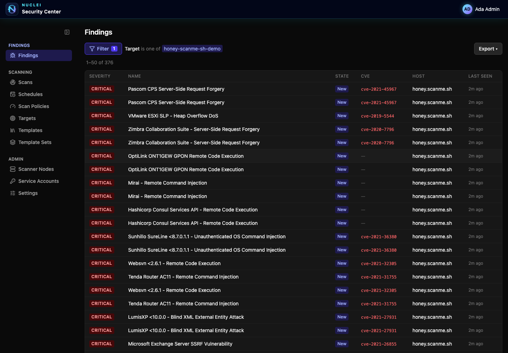

# nuclei-security-center

[](https://github.com/Nikolasel/nuclei-security-center/actions/workflows/ci.yml)
[](LICENSE)
[](https://github.com/Nikolasel/nuclei-security-center/releases)

A web interface for running and triaging [Nuclei](https://github.com/projectdiscovery/nuclei)
scans, built for a small internal security/eng team and portable to any cloud.

A logged-in user defines **targets** and **template sets**, runs scans (on demand or on a
**cron schedule**), and triages the results through a **Tenable-style finding lifecycle** —
dedup, evidence-driven detection state (new / active / resurfaced / mitigated), and analyst
dispositions (accept-risk / false-positive / recast). Findings export as JSON / CSV / SARIF /
raw JSONL. Complete scans export/import as versioned scan bundles (JSON or zip). A **scope
guardrail** keeps every scan inside approved targets, every mutating call
is written to a structured **audit log**, and raw scanner output is archived to object storage.



*Live application screenshot: populated Findings from a honey.scanme.sh full-catalog scan in dark mode.*

## Architecture

Three services, split so the scanner is a disposable, credential-less execution engine:

- **backend** — the system of record. Owns Postgres, runs OIDC/BFF auth, dispatches scans,
  polls the scanner to completion, ingests findings, and serves the API + embedded SPA.
- **scanner node** — runs the `nuclei` binary against a scan spec and serves results over HTTP.
  Holds no database credentials.
- **Postgres** + an **S3-compatible object store** (for the raw-output archive).

```
browser ─▶ React SPA (served by backend at /) ─▶ /api/* (session cookie, roles)
              │
POST /api/scans ─▶ backend ──dispatch──▶ scanner node ──▶ nuclei ──▶ results.jsonl
                    │  ◀────poll/pull──────────┘
                    └─▶ Postgres (scans, findings) + S3 (raw archive)
```

Traffic is strictly backend → scanner. See **[docs/ARCHITECTURE.md](docs/ARCHITECTURE.md)** for
the design rationale.

Both services ship as multi-arch (`linux/amd64` + `linux/arm64`) images on a minimal **Red Hat UBI
10 Micro** base; the scanner is fully self-contained, baking in a checksum-verified, pinned `nuclei`
binary (`NUCLEI_VERSION`) and `naabu`. The backend-owned template catalog is pushed to nodes as a
verified bundle; the image contains no mutable community template cache. See
**[Administration guide → Deployment](docs/ADMIN_GUIDE.md#1-deployment)**.

## Quick start

Requires Docker (Go and the SPA both compile inside the build containers).

```sh
cp .env.example .env          # change SCANNER_TOKEN (at least 32 characters —
                              # `openssl rand -base64 24`; shorter crash-loops
                              # the scanner); see the OIDC note below
docker compose up --build
```

The seeded local Keycloak realm and `.env.example` intentionally contain the same development-only
`OIDC_CLIENT_SECRET`. Either leave that value unchanged locally, or—before the realm is first
imported—change it in both `.env` and `deploy/keycloak/realm-nsc.json` so they still match.

Open **http://localhost:8080** and log in with a demo user (`admin` / `admin`,
`operator` / `operator`, or `viewer` / `viewer`). The compose stack runs backend + UI on `:8080`,
the scanner on `:8081`, plus Postgres, MinIO, and a seeded Keycloak IdP.

> **Beta deployments must start with an empty PostgreSQL database.** Alpha databases are not
> upgradeable; the backend rejects their migration history instead of attempting a partial upgrade.

## Repository layout

```
cmd/backend      backend entrypoint (system of record + orchestrator)
cmd/scanner      scanner node entrypoint (credential-less nuclei runner)
internal/types   wire contracts shared by both services
internal/scanner scanner node: runs nuclei, serves results over HTTP
internal/backend orchestrator, scanner client, HTTP API, OIDC/BFF auth, audit log, scope guardrail
internal/store   Postgres access + embedded migrations
web/             React + TS + Vite SPA (embedded into the backend via go:embed)
deploy/          Dockerfiles + seeded Keycloak realm
docker-compose.yml   postgres + minio + keycloak + scanner + backend
```

## Documentation

- **[Architecture](docs/ARCHITECTURE.md)** — design principles, components, data model, and decisions.
- **[API reference](docs/API.md)** — REST endpoints for scans, findings, dispositions, exports, and schedules.
- **[Administration guide](docs/ADMIN_GUIDE.md)** — deployment, environment variables, authentication, bootstrap, operations, audit, and troubleshooting.
- **[Development](docs/DEVELOPMENT.md)** — local dev workflow, auth-disabled mode, tests, and CI/CD.
- **[Contributing](CONTRIBUTING.md)** — setup, verification gates, invariants, and PR conventions.
- **[Code of Conduct](CODE_OF_CONDUCT.md)** · **[Security Policy](SECURITY.md)** — community standards; private vulnerability reporting.

## License

Copyright (C) 2026 nuclei-security-center contributors

This program is free software: you can redistribute it and/or modify it under
the terms of the GNU Affero General Public License as published by the Free
Software Foundation, either version 3 of the License, or (at your option) any
later version. See [LICENSE](LICENSE) for the complete text.

This program is distributed in the hope that it will be useful, but WITHOUT ANY
WARRANTY; without even the implied warranty of MERCHANTABILITY or FITNESS FOR A
PARTICULAR PURPOSE.

AGPL-3.0 is copyleft, including the network-use clause: anyone running a
modified version as a service must publish the source of their modifications.
(`LICENSE` is the byte-exact canonical FSF text, which is unmodifiable — the
program copyright notice therefore lives here, per the license's own "How to
Apply These Terms" section.)
